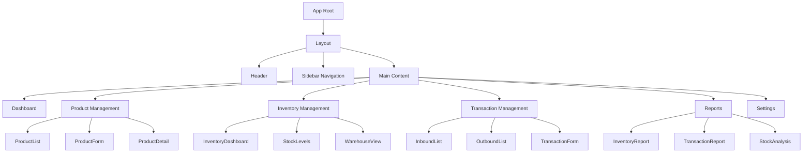
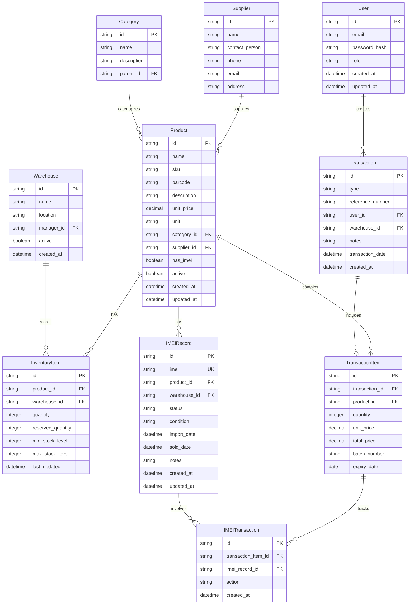
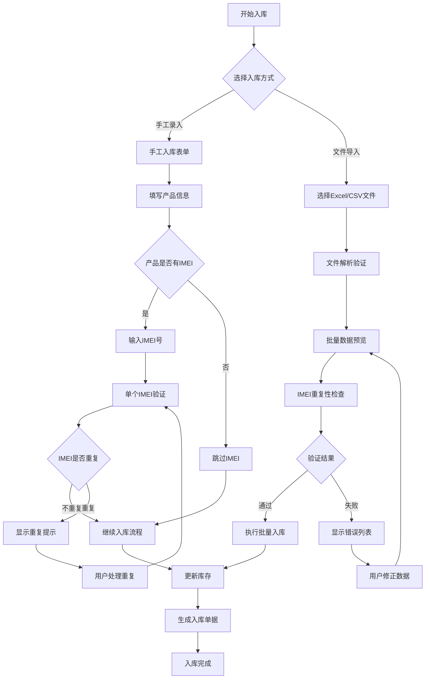
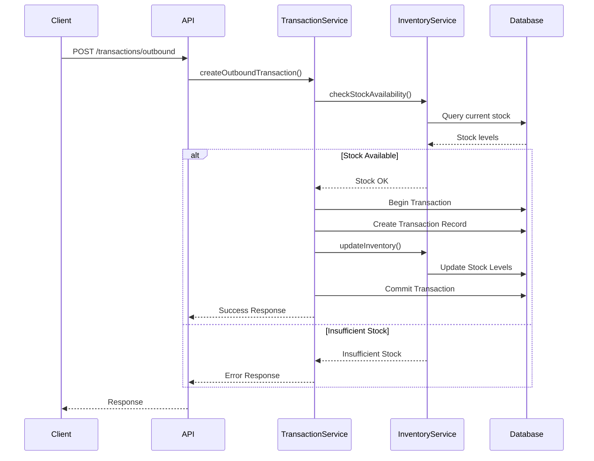
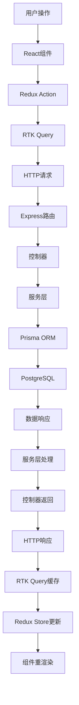
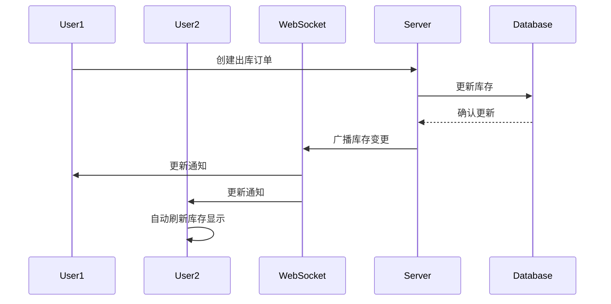

# 产品出入库系统设计文档

登录信息：
用户名：superadmin
密码：admin123
后端
cd 'f:\Workstation\BaiduNetdiskWorkspace\else\qoder\TQ1\backend'; 
node server.js
前端
cd 'f:\Workstation\BaiduNetdiskWorkspace\else\qoder\TQ1\frontend'; npm run dev

## 1. 概述

产品出入库系统是一个基于Web的库存管理解决方案，旨在帮助企业高效管理产品库存、追踪出入库记录、监控库存水平并生成相关报表。系统采用现代化的全栈架构，提供直观易用的用户界面和强大的后台管理功能。

### 核心功能
- 产品信息管理
- 库存实时监控
- 入库管理（采购入库、生产入库、退货入库）
- 出库管理（销售出库、调拨出库、报废出库）
- 库存盘点
- 报表统计分析
- 用户权限管理

### 技术特色
- 响应式Web界面
- 实时库存更新
- 多仓库支持
- 批量操作支持
- 数据导入导出
- 移动端友好

## 2. 技术栈与依赖

### 前端技术栈
- **框架**: React 18+ with TypeScript
- **状态管理**: Redux Toolkit + RTK Query
- **UI组件库**: Ant Design 5.x
- **路由**: React Router 6
- **样式**: Styled Components + Ant Design主题
- **图表**: Apache ECharts
- **表格**: Ant Design Table with虚拟滚动
- **表单**: React Hook Form + Yup验证
- **HTTP客户端**: Axios
- **构建工具**: Vite
- **代码质量**: ESLint + Prettier + Husky

### 后端技术栈
- **框架**: Node.js + Express.js
- **数据库**: PostgreSQL 14+
- **ORM**: Prisma
- **认证**: JWT + bcrypt
- **API文档**: Swagger/OpenAPI 3.0
- **文件上传**: Multer
- **任务队列**: Bull (Redis)
- **缓存**: Redis
- **日志**: Winston
- **测试**: Jest + Supertest

### 基础设施
- **容器化**: Docker + Docker Compose
- **反向代理**: Nginx
- **监控**: Prometheus + Grafana
- **部署**: PM2/容器编排

## 3. 前端架构

### 3.1 组件架构



### 3.2 组件层级结构

#### 页面级组件
- **DashboardPage**: 系统概览，显示关键指标
- **ProductsPage**: 产品管理主页面
- **InventoryPage**: 库存管理主页面
- **TransactionsPage**: 出入库记录页面
- **ReportsPage**: 报表分析页面
- **SettingsPage**: 系统设置页面

#### 业务组件
- **ProductCard**: 产品信息卡片
- **InventoryTable**: 库存列表表格
- **TransactionForm**: 出入库表单
- **StockAlert**: 库存预警组件
- **BarcodeScannar**: 条码扫描组件

#### 通用组件
- **SearchBox**: 搜索框
- **DataTable**: 数据表格
- **FormModal**: 表单弹窗
- **ConfirmDialog**: 确认对话框
- **LoadingSpinner**: 加载动画

### 3.3 状态管理架构

#### Redux Store结构
```typescript
interface RootState {
  auth: AuthState;
  products: ProductsState;
  inventory: InventoryState;
  transactions: TransactionsState;
  warehouses: WarehousesState;
  ui: UIState;
}
```

#### Slice定义
- **authSlice**: 用户认证状态
- **productsSlice**: 产品数据管理
- **inventorySlice**: 库存状态管理
- **transactionsSlice**: 出入库记录
- **warehousesSlice**: 仓库信息
- **uiSlice**: UI状态（加载、弹窗等）

### 3.4 路由架构

```mermaid
graph LR
    A[/] --> B[Dashboard]
    A --> C[/products]
    A --> D[/inventory]
    A --> E[/transactions]
    A --> F[/reports]
    A --> G[/settings]
    
    C --> C1[/products/list]
    C --> C2[/products/new]
    C --> C3[/products/:id]
    
    D --> D1[/inventory/overview]
    D --> D2[/inventory/stock-levels]
    D --> D3[/inventory/warehouses]
    
    E --> E1[/transactions/inbound]
    E --> E2[/transactions/outbound]
    E --> E3[/transactions/history]
```

### 3.5 API集成层

#### RTK Query API定义
```typescript
export const inventoryApi = createApi({
  reducerPath: 'inventoryApi',
  baseQuery: fetchBaseQuery({
    baseUrl: '/api/v1/',
    prepareHeaders: (headers, { getState }) => {
      const token = selectAuthToken(getState());
      if (token) {
        headers.set('authorization', `Bearer ${token}`);
      }
      return headers;
    },
  }),
  tagTypes: ['Product', 'Inventory', 'Transaction'],
  endpoints: (builder) => ({
    getProducts: builder.query<Product[], void>({
      query: () => 'products',
      providesTags: ['Product'],
    }),
    // 其他API端点...
  }),
});
```

## 4. 后端架构

### 4.1 API端点规范

#### 产品管理 API
| 方法 | 端点 | 描述 | 认证要求 |
|------|------|------|----------|
| GET | `/api/v1/products` | 获取产品列表 | Bearer Token |
| POST | `/api/v1/products` | 创建新产品 | Admin |
| GET | `/api/v1/products/:id` | 获取产品详情 | Bearer Token |
| PUT | `/api/v1/products/:id` | 更新产品信息 | Admin |
| DELETE | `/api/v1/products/:id` | 删除产品 | Admin |

#### 库存管理 API
| 方法 | 端点 | 描述 | 认证要求 |
|------|------|------|----------|
| GET | `/api/v1/inventory` | 获取库存总览 | Bearer Token |
| GET | `/api/v1/inventory/product/:productId` | 获取特定产品库存 | Bearer Token |
| POST | `/api/v1/inventory/adjust` | 库存调整 | Manager |
| GET | `/api/v1/inventory/low-stock` | 获取低库存预警 | Bearer Token |

#### 入库管理 API
| 方法 | 端点 | 描述 | 认证要求 |
|------|------|------|----------|
| POST | `/api/v1/import/validate-file` | 验证导入文件格式 | Operator |
| POST | `/api/v1/import/validate-imei` | 批量IMEI验证 | Operator |
| POST | `/api/v1/import/preview` | 预览导入数据 | Operator |
| POST | `/api/v1/transactions/inbound` | 创建入库记录 | Operator |
| POST | `/api/v1/transactions/inbound/batch` | 批量入库 | Operator |
| GET | `/api/v1/transactions/inbound/template` | 下载导入模板 | Bearer Token |

#### 出库管理 API
| 方法 | 端点 | 描述 | 认证要求 |
|------|------|------|----------|
| POST | `/api/v1/transactions/outbound` | 创建出库记录 | Operator |
| GET | `/api/v1/transactions` | 获取交易记录 | Bearer Token |
| GET | `/api/v1/transactions/:id` | 获取交易详情 | Bearer Token |

### 4.2 数据模型与ORM映射

#### 核心数据模型



#### Prisma Schema定义示例
```prisma
model Product {
  id          String   @id @default(cuid())
  name        String
  sku         String   @unique
  barcode     String?  @unique
  description String?
  unitPrice   Decimal  @map("unit_price") @db.Decimal(10, 2)
  unit        String
  categoryId  String?  @map("category_id")
  supplierId  String?  @map("supplier_id")
  hasImei     Boolean  @default(false) @map("has_imei")
  active      Boolean  @default(true)
  createdAt   DateTime @default(now()) @map("created_at")
  updatedAt   DateTime @updatedAt @map("updated_at")
  
  category        Category?         @relation(fields: [categoryId], references: [id])
  supplier        Supplier?         @relation(fields: [supplierId], references: [id])
  inventoryItems  InventoryItem[]
  transactionItems TransactionItem[]
  imeiRecords     IMEIRecord[]
  
  @@map("products")
}

model IMEIRecord {
  id            String   @id @default(cuid())
  imei          String   @unique
  productId     String   @map("product_id")
  warehouseId   String?  @map("warehouse_id")
  status        String   @default("AVAILABLE") // AVAILABLE, SOLD, DAMAGED, RETURNED
  condition     String   @default("NEW") // NEW, USED, REFURBISHED, DAMAGED
  importDate    DateTime @default(now()) @map("import_date")
  soldDate      DateTime? @map("sold_date")
  notes         String?
  createdAt     DateTime @default(now()) @map("created_at")
  updatedAt     DateTime @updatedAt @map("updated_at")
  
  product          Product            @relation(fields: [productId], references: [id])
  warehouse        Warehouse?         @relation(fields: [warehouseId], references: [id])
  imeiTransactions IMEITransaction[]
  
  @@map("imei_records")
}

model TransactionItem {
  id             String   @id @default(cuid())
  transactionId  String   @map("transaction_id")
  productId      String   @map("product_id")
  quantity       Int
  unitPrice      Decimal  @map("unit_price") @db.Decimal(10, 2)
  totalPrice     Decimal  @map("total_price") @db.Decimal(10, 2)
  batchNumber    String?  @map("batch_number")
  expiryDate     DateTime? @map("expiry_date")
  notes          String?
  createdAt      DateTime @default(now()) @map("created_at")
  
  transaction      Transaction       @relation(fields: [transactionId], references: [id])
  product          Product           @relation(fields: [productId], references: [id])
  imeiTransactions IMEITransaction[]
  
  @@map("transaction_items")
}

model IMEITransaction {
  id                String   @id @default(cuid())
  transactionItemId String   @map("transaction_item_id")
  imeiRecordId      String   @map("imei_record_id")
  action            String   // INBOUND, OUTBOUND, TRANSFER, ADJUSTMENT
  createdAt         DateTime @default(now()) @map("created_at")
  
  transactionItem TransactionItem @relation(fields: [transactionItemId], references: [id])
  imeiRecord      IMEIRecord      @relation(fields: [imeiRecordId], references: [id])
  
  @@map("imei_transactions")
}

model ImportLog {
  id          String   @id @default(cuid())
  fileName    String   @map("file_name")
  fileSize    Int      @map("file_size")
  totalRows   Int      @map("total_rows")
  successRows Int      @map("success_rows")
  errorRows   Int      @map("error_rows")
  userId      String   @map("user_id")
  status      String   @default("PROCESSING") // PROCESSING, COMPLETED, FAILED
  errorLog    Json?    @map("error_log")
  createdAt   DateTime @default(now()) @map("created_at")
  
  user User @relation(fields: [userId], references: [id])
  
  @@map("import_logs")
}
```

**IMEI管理服务实现**
```typescript
class IMEIService {
  // 验证IMEI格式
  static validateIMEIFormat(imei: string): boolean {
    // IMEI必须是15位数字
    if (!/^\d{15}$/.test(imei)) {
      return false;
    }
    
    // Luhn算法验证IMEI校验位
    return this.luhnCheck(imei);
  }
  
  // 批量IMEI验证
  async validateIMEIBatch(imeiList: string[]): Promise<IMEIValidationResult> {
    const result: IMEIValidationResult = {
      validIMEIs: [],
      duplicateIMEIs: [],
      invalidFormatIMEIs: []
    };
    
    for (const imei of imeiList) {
      // 格式验证
      if (!this.validateIMEIFormat(imei)) {
        result.invalidFormatIMEIs.push({
          imei,
          error: 'Invalid IMEI format'
        });
        continue;
      }
      
      // 重复性检查
      const existingRecord = await prisma.iMEIRecord.findUnique({
        where: { imei },
        include: {
          product: { select: { name: true, sku: true } },
          warehouse: { select: { name: true } }
        }
      });
      
      if (existingRecord) {
        result.duplicateIMEIs.push({
          imei,
          existingProductId: existingRecord.productId,
          existingWarehouse: existingRecord.warehouse?.name || 'Unknown',
          status: existingRecord.status
        });
      } else {
        result.validIMEIs.push(imei);
      }
    }
    
    return result;
  }
  
  // 批量创建IMEI记录
  async createIMEIRecordsBatch(
    productId: string,
    warehouseId: string,
    imeiList: string[]
  ): Promise<void> {
    const records = imeiList.map(imei => ({
      imei,
      productId,
      warehouseId,
      status: 'AVAILABLE',
      condition: 'NEW'
    }));
    
    await prisma.iMEIRecord.createMany({
      data: records,
      skipDuplicates: false // 不允许重复
    });
  }
  
  private static luhnCheck(imei: string): boolean {
    let sum = 0;
    let isEven = false;
    
    for (let i = imei.length - 1; i >= 0; i--) {
      let digit = parseInt(imei.charAt(i));
      
      if (isEven) {
        digit *= 2;
        if (digit > 9) {
          digit -= 9;
        }
      }
      
      sum += digit;
      isEven = !isEven;
    }
    
    return sum % 10 === 0;
  }
}
```

### 4.3 业务逻辑层架构

#### 服务层组织结构
```
src/
├── services/
│   ├── ProductService.ts        # 产品管理逻辑
│   ├── InventoryService.ts      # 库存管理逻辑
│   ├── TransactionService.ts    # 出入库逻辑
│   ├── IMEIService.ts           # IMEI管理与验证
│   ├── ImportService.ts         # 批量导入服务
│   ├── ReportService.ts         # 报表生成逻辑
│   ├── NotificationService.ts   # 通知服务
│   └── AuthService.ts          # 认证授权
├── controllers/
│   ├── ProductController.ts
│   ├── InventoryController.ts
│   ├── TransactionController.ts
│   └── IMEIController.ts
└── utils/
    ├── validators.ts
    ├── imeiValidator.ts         # IMEI验证工具
    ├── constants.ts
    └── helpers.ts
```

#### 产品入库业务逻辑

**入库流程设计**


**导入文件格式要求**

| 字段名 | 是否必填 | 数据类型 | 示例 | 说明 |
|---------|---------|----------|------|------|
| 产品名称 | 是 | 文本 | iPhone 14 Pro | 产品全名 |
| 产品SKU | 是 | 文本 | IP14P-256-BLU | 唯一识别码 |
| 数量 | 是 | 整数 | 10 | 入库数量 |
| 单价 | 是 | 数字 | 8999.00 | 入库单价 |
| IMEI号 | 条件必填 | 文本 | 123456789012345 | 15位数字，多个用分号隔开 |
| 批次号 | 否 | 文本 | BATCH-001 | 产品批次 |
| 有效期 | 否 | 日期 | 2025-12-31 | YYYY-MM-DD格式 |
| 仓库 | 是 | 文本 | 主仓库 | 入库仓库 |
| 备注 | 否 | 文本 | 采购入库 | 额外说明 |

**导入模板示例**
```csv
产品名称,产品SKU,数量,单价,IMEI号,批次号,有效期,仓库,备注
iPhone 14 Pro,IP14P-256-BLU,2,8999.00,"123456789012345,123456789012346",,2025-12-31,主仓库,采购入库
小米手机,MI-128-WHT,5,2999.00,"987654321098765,987654321098766,987654321098767,987654321098768,987654321098769",BATCH-001,,主仓库,生产入库
电脑内存,RAM-8GB-DDR4,100,299.00,,MEM-2024-01,2026-06-30,主仓库,采购入库
```

#### 核心业务逻辑

**IMEI重复性验证逻辑**
```mermaid
sequenceDiagram
    participant User
    participant Frontend
    participant API
    participant IMEIService
    participant Database
    
    User->>Frontend: 上传入库文件/输入IMEI
    Frontend->>API: POST /api/v1/import/validate-imei
    API->>IMEIService: validateIMEIBatch(imeiList)
    
    loop 逐个验证IMEI
        IMEIService->>Database: 查询IMEI是否存在
        Database-->>IMEIService: 返回查询结果
        
        alt IMEI已存在
            IMEIService->>IMEIService: 标记为重复
        else IMEI不存在
            IMEIService->>IMEIService: 标记为可用
        end
    end
    
    IMEIService-->>API: 返回验证结果
    API-->>Frontend: {
        validIMEIs: [],
        duplicateIMEIs: [],
        invalidFormatIMEIs: []
    }
    
    alt 有重复或无效IMEI
        Frontend->>User: 显示错误列表
        User->>Frontend: 修正数据
        Frontend->>API: 重新验证
    else 全部验证通过
        Frontend->>API: POST /api/v1/transactions/inbound
        API->>IMEIService: 批量创建IMEI记录
        IMEIService->>Database: 插入IMEI数据
    end
```

**入库数据模型**
```typescript
interface InboundRequest {
  warehouseId: string;
  transactionType: 'PURCHASE' | 'PRODUCTION' | 'RETURN' | 'ADJUSTMENT';
  referenceNumber?: string;
  notes?: string;
  items: InboundItem[];
}

interface InboundItem {
  productId: string;
  quantity: number;
  unitPrice: number;
  imeiNumbers?: string[];  // IMEI号列表（如果产品支持IMEI）
  batchNumber?: string;
  expiryDate?: Date;
  notes?: string;
}

interface IMEIValidationResult {
  validIMEIs: string[];
  duplicateIMEIs: Array<{
    imei: string;
    existingProductId: string;
    existingWarehouse: string;
    status: string;
  }>;
  invalidFormatIMEIs: Array<{
    imei: string;
    error: string;
  }>;
}
```

**库存更新逻辑**


### 4.4 中间件与拦截器

#### 认证中间件
```typescript
export const authMiddleware = (req: Request, res: Response, next: NextFunction) => {
  const token = req.headers.authorization?.split(' ')[1];
  
  if (!token) {
    return res.status(401).json({ error: 'Access token required' });
  }
  
  try {
    const decoded = jwt.verify(token, process.env.JWT_SECRET!);
    req.user = decoded;
    next();
  } catch (error) {
    return res.status(401).json({ error: 'Invalid token' });
  }
};
```

#### 权限控制中间件
```typescript
export const requireRole = (roles: string[]) => {
  return (req: Request, res: Response, next: NextFunction) => {
    if (!req.user || !roles.includes(req.user.role)) {
      return res.status(403).json({ error: 'Insufficient permissions' });
    }
    next();
  };
};
```

#### 日志中间件
```typescript
export const requestLogger = (req: Request, res: Response, next: NextFunction) => {
  const start = Date.now();
  
  res.on('finish', () => {
    const duration = Date.now() - start;
    logger.info({
      method: req.method,
      url: req.url,
      status: res.statusCode,
      duration: `${duration}ms`,
      userAgent: req.get('User-Agent'),
      ip: req.ip,
    });
  });
  
  next();
};
```

## 5. 数据流架构

### 5.1 前后端数据流



### 5.2 实时数据同步



## 6. 测试策略

### 6.1 前端测试

#### 单元测试
- **组件测试**: React Testing Library
- **工具函数测试**: Jest
- **Redux逻辑测试**: Redux Toolkit测试工具
- **API集成测试**: MSW (Mock Service Worker)

#### 集成测试
- **页面流程测试**: Testing Library
- **用户交互测试**: user-event
- **表单验证测试**: React Hook Form测试

#### E2E测试
- **关键业务流程**: Playwright
- **跨浏览器测试**: Playwright多浏览器支持
- **移动端测试**: Playwright移动设备模拟

### 6.2 后端测试

#### 单元测试
```typescript
describe('InventoryService', () => {
  describe('updateStock', () => {
    it('should update stock when sufficient quantity available', async () => {
      const mockInventory = { quantity: 100, reserved: 10 };
      const updateData = { quantity: -20 };
      
      jest.spyOn(inventoryRepository, 'findByProductId')
        .mockResolvedValue(mockInventory);
      
      const result = await inventoryService.updateStock('product-1', updateData);
      
      expect(result.quantity).toBe(80);
      expect(result.reserved).toBe(10);
    });
    
    it('should throw error when insufficient stock', async () => {
      const mockInventory = { quantity: 10, reserved: 5 };
      const updateData = { quantity: -20 };
      
      await expect(
        inventoryService.updateStock('product-1', updateData)
      ).rejects.toThrow('Insufficient stock');
    });
  });
});
```

#### 集成测试
```typescript
describe('POST /api/v1/transactions/outbound', () => {
  it('should create outbound transaction and update inventory', async () => {
    const transactionData = {
      items: [{ productId: 'product-1', quantity: 10 }],
      warehouseId: 'warehouse-1',
      notes: 'Sales order #12345'
    };
    
    const response = await request(app)
      .post('/api/v1/transactions/outbound')
      .set('Authorization', `Bearer ${authToken}`)
      .send(transactionData)
      .expect(201);
    
    expect(response.body.transaction.type).toBe('OUTBOUND');
    
    // 验证库存是否正确更新
    const updatedInventory = await inventoryService.getByProductId('product-1');
    expect(updatedInventory.quantity).toBe(90); // 假设之前是100
  });
});
```